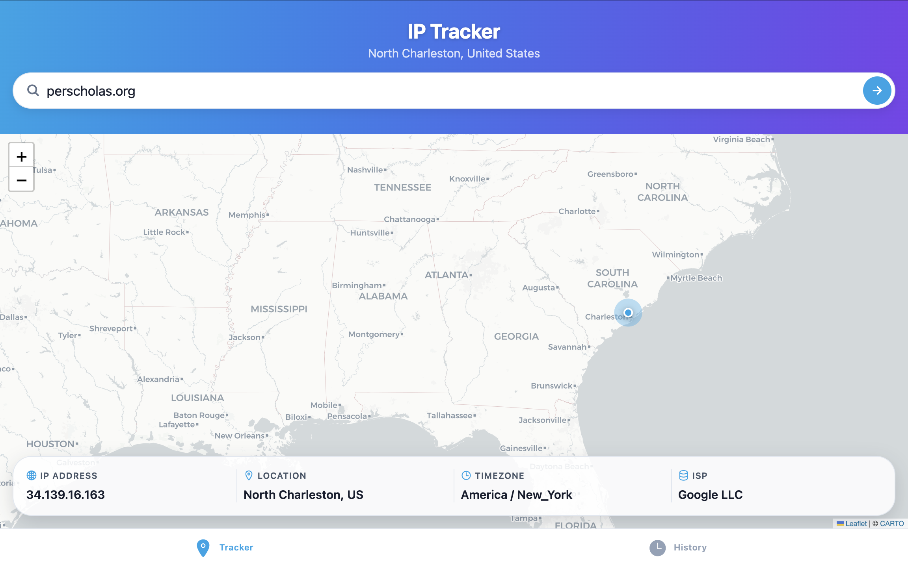
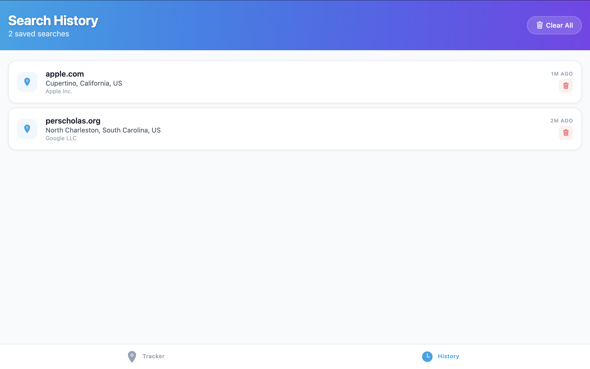

<p align="center">
  
</p>

<p align="center">
  
</p>

<h1 align="center">IP Address Tracker</h1>

<p align="center">
  A cross-platform app to geolocate any IP address or domain — with an interactive map, detailed network info, and persistent search history.
</p>

<p align="center">
  <a href="https://ip-address-tracker-devartslab.netlify.app">🌐 Live Demo</a>
</p>

## Table of Contents

- [Features](#features)
- [Tech Stack](#tech-stack)
- [Getting Started](#getting-started)
- [Running on Web](#running-on-web)
- [Running on iOS](#running-on-ios)
- [Project Structure](#project-structure)
- [Deployment](#deployment)

---

## Features

- **IP & domain lookup** — geolocate any IPv4, IPv6, or domain name
- **Interactive map** — Leaflet (web) / Apple Maps (iOS) with animated marker
- **Geo details** — city, region, country, timezone, ISP, ZIP code
- **Auto-detect** — looks up your own IP on launch
- **Search history** — persisted locally, tap any entry to re-lookup
- **Dark / light mode** — follows system theme
- **Responsive** — works on web, iOS, and Android

---

## Tech Stack

| Layer        | Technology                                       |
| ------------ | ------------------------------------------------ |
| Framework    | Expo 54 + Expo Router (file-based routing)       |
| Language     | TypeScript                                       |
| UI           | React Native + react-native-web                  |
| Map (web)    | Leaflet via iframe                               |
| Map (iOS)    | react-native-maps (Apple Maps)                   |
| Animations   | react-native-reanimated v4                       |
| Blur / Glass | expo-blur                                        |
| Gradient     | expo-linear-gradient                             |
| Storage      | @react-native-async-storage/async-storage        |
| Geo API      | ip-api.com (via Netlify serverless proxy on web) |
| Own-IP API   | api.ipify.org                                    |
| Hosting      | Netlify (static export + serverless function)    |

---

## Getting Started

```bash
# Install dependencies
npm install

# Start the dev server
npx expo start
```

---

## Running on Web

```bash
# Local development (Metro only)
npx expo start --web

# Local development with Netlify functions proxy (fixes CORS)
npx netlify-cli dev --target-port 8081 --framework '#custom'
# Then open http://localhost:8888
```

---

## Running on iOS

```bash
# Run in iOS Simulator (requires Xcode)
npx expo run:ios

# Or open the workspace directly
open ios/*.xcworkspace
```

---

## Project Structure

```
app/
  _layout.tsx          # Root layout, wraps IpTrackerProvider
  (tabs)/
    _layout.tsx        # Tab navigator (Tracker + History)
    index.tsx          # Tracker screen
    history.tsx        # History screen
components/
  MapContainer.tsx     # Native map (iOS/Android)
  MapContainer.web.tsx # Leaflet iframe map (web)
  IpInfoCard.tsx       # Geo info card with glassmorphism
  SearchBar.tsx        # IP/domain search input
context/
  IpTrackerContext.tsx # Global state (useReducer)
services/
  ipService.ts         # getOwnIp(), lookupIp()
  historyService.ts    # AsyncStorage history CRUD
constants/
  theme.ts             # Colors, spacing, typography
netlify/
  functions/geo.js     # Serverless proxy for ip-api.com
```

---

## Deployment

The app is deployed to Netlify as a static web export with a serverless function that proxies geo API requests to avoid CORS restrictions.

```bash
# Build and deploy
npx expo export -p web
npx netlify-cli deploy --dir=dist --prod
```

Live URL: **https://ip-address-tracker-devartslab.netlify.app**

## Acknowledgments

Special thanks and a shout out to the following individuals and organizations:

- [Per Scholas](https://www.perscholas.org/) for their exceptional coding school, providing valuable learning resources and support.
- Our instructor [Darnell Champen](https://www.linkedin.com/in/darnell-champen/) for his guidance, mentorship, and countless hours of dedication for the success of our team.
- Hat tip to anyone whose libraries were used.

<a id="author"></a>

## 👨‍💻 Author

[](http://devartslab.com/)

Boston, MA, USA <br>
2026
